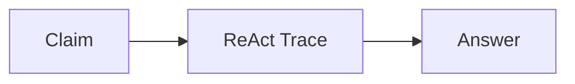
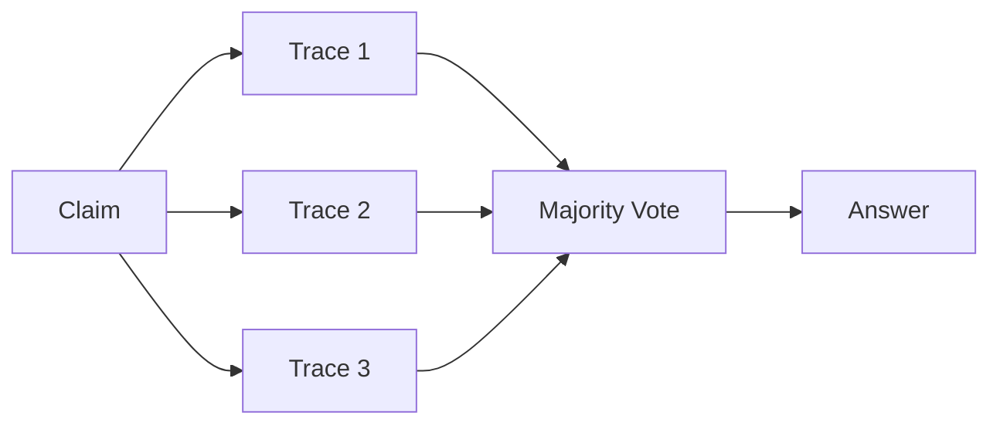
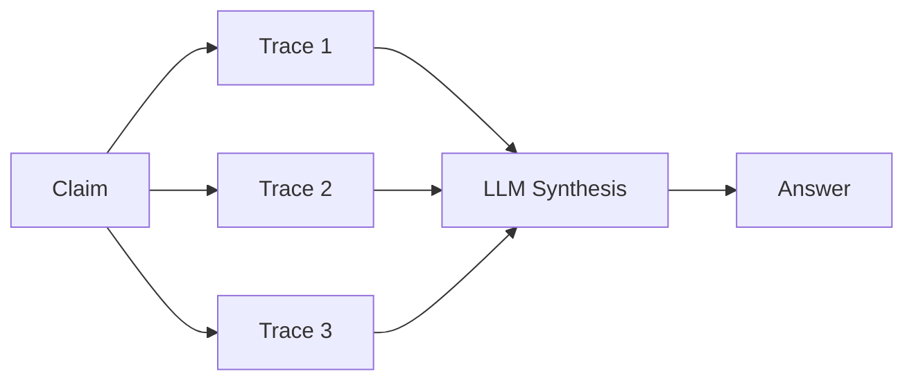
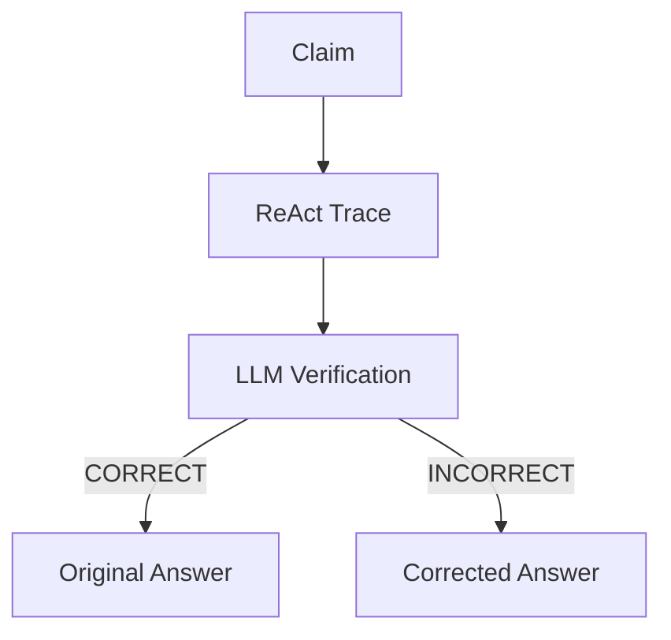
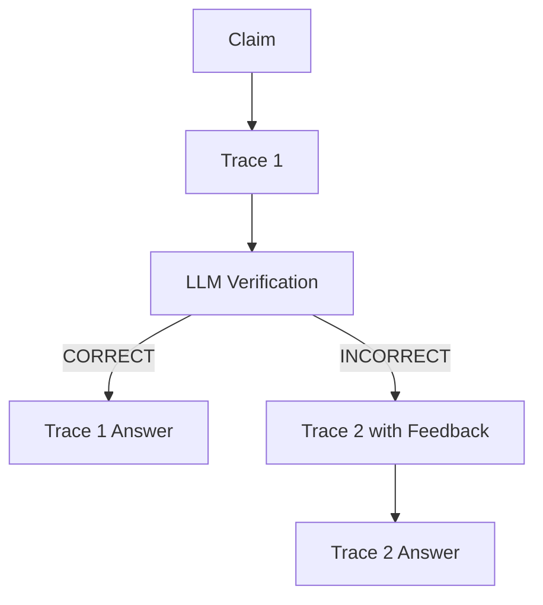

# FEVER Agent Frameworks

This document describes the different agent frameworks implemented for the FEVER (Fact Extraction and VERification) dataset. All frameworks are based on the core ReAct (Reasoning and Acting) pattern but differ in how they achieve robustness and accuracy.

## Framework Overview

| Framework | File | Traces | Answer Selection |
|-----------|------|--------|------------------|
| ReAct | `react_agent.py` | 1 | Direct from trace |
| Majority Voting | `majority_voting_agent.py` | 3 | Vote counting |
| CoT-SC | `cot_sc_agent.py` | 3 | LLM synthesis |
| Self-Reflection | `self_reflection_agent.py` | 1 | LLM correction |
| Reflexion | `reflexion_react_agent.py` | 1-2 | Conditional retry |

---

## 1. ReAct (Baseline)

**File**: [`react_agent.py`](../src/agents/fever/react_agent.py)

The standard single-trace ReAct agent. Executes one deterministic reasoning trace with temperature=0.0.

### Process


### Key Characteristics
- Single trace execution
- Temperature: 0.0 (deterministic)
- Fastest execution (fewest LLM calls)
- No error correction mechanism

---

## 2. Majority Voting

**File**: [`majority_voting_agent.py`](../src/agents/fever/majority_voting_agent.py)

Runs multiple independent ReAct traces and selects the answer with the most votes.

### Process


### Key Characteristics
- Default: 3 traces with temperature=0.7 for diversity
- Simple voting mechanism (≥2 votes wins)
- Ties default to "NOT ENOUGH INFO"
- No semantic analysis of reasoning quality

---

## 3. CoT-SC (Chain-of-Thought Self-Consistency)

**File**: [`cot_sc_agent.py`](../src/agents/fever/cot_sc_agent.py)

Runs multiple ReAct traces and uses an LLM to synthesize the final answer by analyzing all reasoning trajectories.

### Process


### Key Characteristics
- Default: 3 traces with temperature=0.7
- LLM evaluates quality of evidence in each trace
- Can select minority answer if reasoning is stronger
- More intelligent than simple voting but higher cost (synthesis call)

### Difference from Majority Voting
- Majority Voting: Pure vote counting, ignores reasoning quality
- CoT-SC: LLM analyzes trajectories to determine best answer based on evidence quality

---

## 4. Self-Reflection

**File**: [`self_reflection_agent.py`](../src/agents/fever/self_reflection_agent.py)  
**Prompt**: [`prompts/fever_self_reflection.json`](../src/agents/fever/prompts/fever_self_reflection.json)

Runs a single ReAct trace, then uses an LLM to verify and potentially **correct** the answer based solely on the evidence in the trace.

### Process


### Key Characteristics
- Single trace + one verification call
- LLM outputs: Verification status, Reasoning, and **Corrected Answer**
- Does NOT run a second trace if incorrect
- Correction is based on evidence already in the trace
- 2 LLM calls total (1 trace + 1 verification)

### Output Format
```
Verification: [CORRECT or INCORRECT]
Reasoning: [Brief explanation]
Final Answer: [The correct answer based on the trace]
```

---

## 5. Reflexion

**File**: [`reflexion_react_agent.py`](../src/agents/fever/reflexion_react_agent.py)  
**Prompt**: [`prompts/fever_reflexion.json`](../src/agents/fever/prompts/fever_reflexion.json)

Runs a ReAct trace, verifies the answer, and if incorrect, runs a **second trace** with the verification feedback as context.

### Process


### Key Characteristics
- 1-2 traces depending on verification result
- Verification feedback is prepended to the second trace prompt
- Second trace can explore different search paths
- 2-4 LLM calls total (1-2 traces + 1 verification)

### Verification Output Format
```
Verification: [CORRECT or INCORRECT]
Reasoning: [Explanation of what was wrong and guidance for retry]
```

### Feedback Context (for Trace 2)
```
Previous attempt analysis:
You previously attempted this claim and concluded with: [answer]
However, this answer was incorrect.

Verification feedback: [reasoning from verification]

Use this feedback to guide your search and reasoning in this attempt.
```

---

## Key Differences: Self-Reflection vs Reflexion

| Aspect | Self-Reflection | Reflexion |
|--------|-----------------|-----------|
| Traces executed | Always 1 | 1 or 2 |
| On incorrect answer | LLM corrects answer directly | Runs new trace with feedback |
| Correction source | Same trace evidence | New search actions in second trace |
| LLM calls | Exactly 2 | 2-4 (depending on verification) |
| Can find new evidence | No | Yes (second trace can search) |

### When to use which?
- **Self-Reflection**: When the evidence is likely already present but misinterpreted
- **Reflexion**: When the initial search strategy may have missed relevant evidence

---

## Common Utilities

All frameworks share utilities from [`fever_utils.py`](../src/agents/fever/fever_utils.py):

- `run_single_trace()`: Core ReAct trace execution
- `llm()`: LLM API wrapper with rate limiting
- `extract_trajectories_from_traces()`: Format traces for synthesis
- `synthesize_answer_with_llm()`: CoT-SC synthesis logic
- `WEBTHINK_PROMPT_TEMPLATE`: Base prompt for all ReAct traces

---

## Running Experiments

All frameworks can be run through the experiment runner:

```bash
python src/agents/fever/run_experiments.py \
    --num-examples 20 \
    --seed 104 \
    --frameworks react cot_sc reflexion majority_voting
```

Results are saved to `results/fever/` with per-framework JSON files.
