# HotPotQA Agent Frameworks

This document describes the different agent frameworks implemented for the HotPotQA multi-hop question answering dataset. All frameworks are based on the core ReAct (Reasoning and Acting) pattern but differ in how they handle multi-hop reasoning, answer selection, and error correction.

## Framework Overview

| Framework | File | Traces | Answer Selection | LLM Calls |
|-----------|------|--------|------------------|-----------|
| ReAct | `react_agent.py` | 1 | Direct from trace | 1-7 per trace |
| Majority Voting | `majority_voting_agent.py` | 3 | Semantic vote | 3 × (1-7) + 1 |
| CoT-SC | `cot_sc_agent.py` | 3 | LLM synthesis | 3 × (1-7) + 1 |
| Self-Reflection | `self_reflection_agent.py` | 1 | LLM correction | (1-7) + 1 |
| Reflexion | `reflexion_react_agent.py` | 1-2 | Conditional retry | (1-7) × traces + 1 |

---

## Architecture Overview

```mermaid
flowchart TB
    subgraph Core["Core Components"]
        Q[Question from HotPotQA]
        ENV[WikiEnv + HotPotQAWrapper]
        LLM[Gemini 2.5 Flash]
        UTILS[hotpotqa_utils.py]
    end

    subgraph Frameworks["Agent Frameworks"]
        R[ReAct]
        MV[Majority Voting]
        COT[CoT-SC]
        SR[Self-Reflection]
        REF[Reflexion]
    end

    Q --> ENV
    ENV --> Frameworks
    LLM --> Frameworks
    UTILS --> |run_single_trace| Frameworks
    UTILS --> |llm_judge_answer| Frameworks
    UTILS --> |synthesize_answer_with_llm| COT
    UTILS --> |majority_vote_semantic| MV

    style Core fill:#2d3748
    style Frameworks fill:#1a365d
```

---

## 1. ReAct (Baseline)

**File**: [`react_agent.py`](../src/agents/hotpotqa/react_agent.py)

The standard single-trace ReAct agent. Executes one deterministic reasoning trace with temperature=0.0 to answer multi-hop questions.

### Process


### Detailed Trace Flow

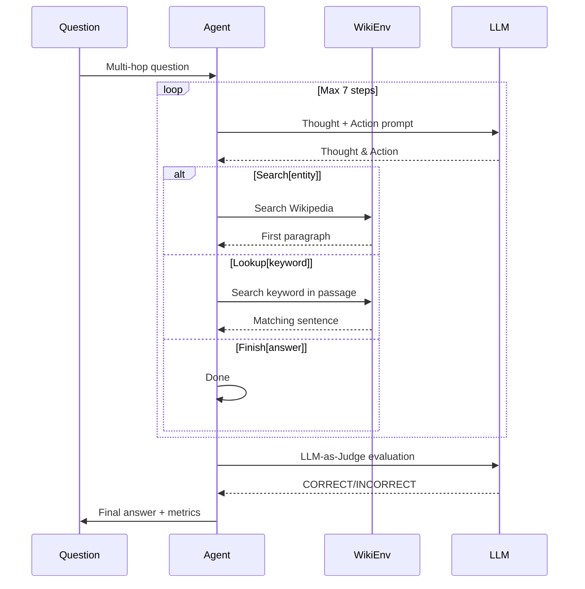

### Key Characteristics

- **Single trace execution** - One attempt to answer the question
- **Temperature: 0.0** - Deterministic output
- **Fastest execution** - Fewest LLM calls
- **No error correction** - What you get is what you get
- **LLM-as-Judge** - Semantic evaluation beyond exact match

### Code Example

```python
from react_agent import run_react

reward, info = run_react(idx=0, to_print=True)
# Returns: EM score, full trace info with LLM-judge results
```

---

## 2. Majority Voting

**File**: [`majority_voting_agent.py`](../src/agents/hotpotqa/majority_voting_agent.py)

Runs 3 independent ReAct traces with temperature=0.7 for diversity, then uses LLM-based semantic majority voting to determine the final answer.

### Process

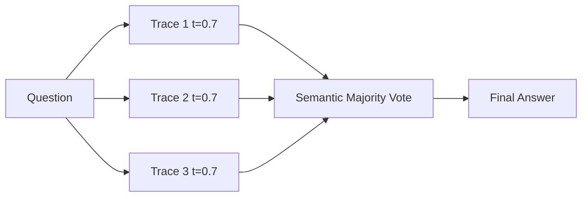

### Semantic Voting Logic

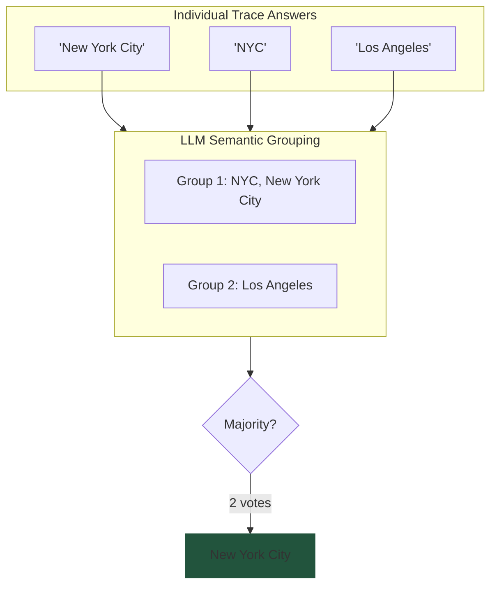

### Key Characteristics

- **Default: 3 traces** with temperature=0.7 for diverse reasoning paths
- **LLM-based semantic voting** - Understands "NYC" = "New York City"
- **Handles free-form answers** - Unlike FEVER's discrete labels
- **Single synthesis call** - LLM groups equivalent answers
- **Tie-breaking** - Most reasonable answer if all different

### Difference from FEVER Majority Voting

| Aspect | HotPotQA | FEVER |
|--------|----------|-------|
| Answer type | Free-form text | 3 classes |
| Voting method | LLM semantic grouping | Simple vote count |
| Tie handling | LLM picks most reasonable | Default to "NOT ENOUGH INFO" |

---

## 3. CoT-SC (Chain-of-Thought Self-Consistency)

**File**: [`cot_sc_agent.py`](../src/agents/hotpotqa/cot_sc_agent.py)

Runs 3 independent ReAct traces and synthesizes the final answer using an LLM that evaluates all reasoning trajectories holistically.

### Process

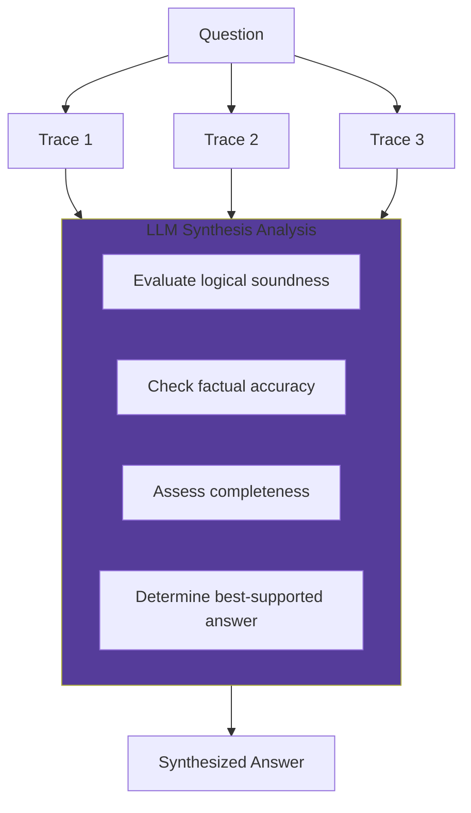

### Synthesis Prompt Strategy

The synthesis LLM receives all 3 full trajectories and:

1. **Evaluates logical soundness** - Is the reasoning valid?
2. **Checks factual accuracy** - Do observations support conclusions?
3. **Assesses relevance** - Did the trace answer the actual question?
4. **Determines completeness** - Were both hops of reasoning addressed?

### Key Characteristics

- **Default: 3 traces** with temperature=0.7
- **Full trajectory analysis** - Not just final answers
- **Can select minority answer** - If reasoning is stronger
- **Quality over quantity** - Best evidence wins, not most votes
- **Higher cost** - Extra synthesis call required

### Difference from Majority Voting

| Aspect | CoT-SC | Majority Voting |
|--------|--------|-----------------|
| Selection criteria | Best reasoning quality | Most common answer |
| Input to selector | Full trajectories | Final answers only |
| Can pick minority | Yes, if better reasoning | No, always majority |
| Use case | Complex multi-hop | Simple factoid |

---

## 4. Self-Reflection

**File**: [`self_reflection_agent.py`](../src/agents/hotpotqa/self_reflection_agent.py)  
**Prompt**: [`prompts/hotpotqa_self_reflection.json`](../src/agents/hotpotqa/prompts/hotpotqa_self_reflection.json)

Runs a single ReAct trace, then uses an LLM to verify and potentially **correct** the answer based solely on the evidence already in the trace.

### Process

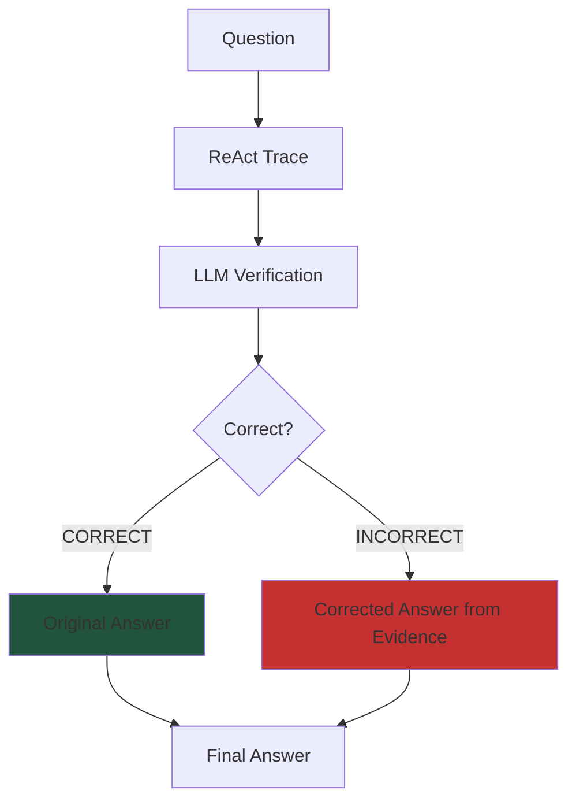

### Verification Logic

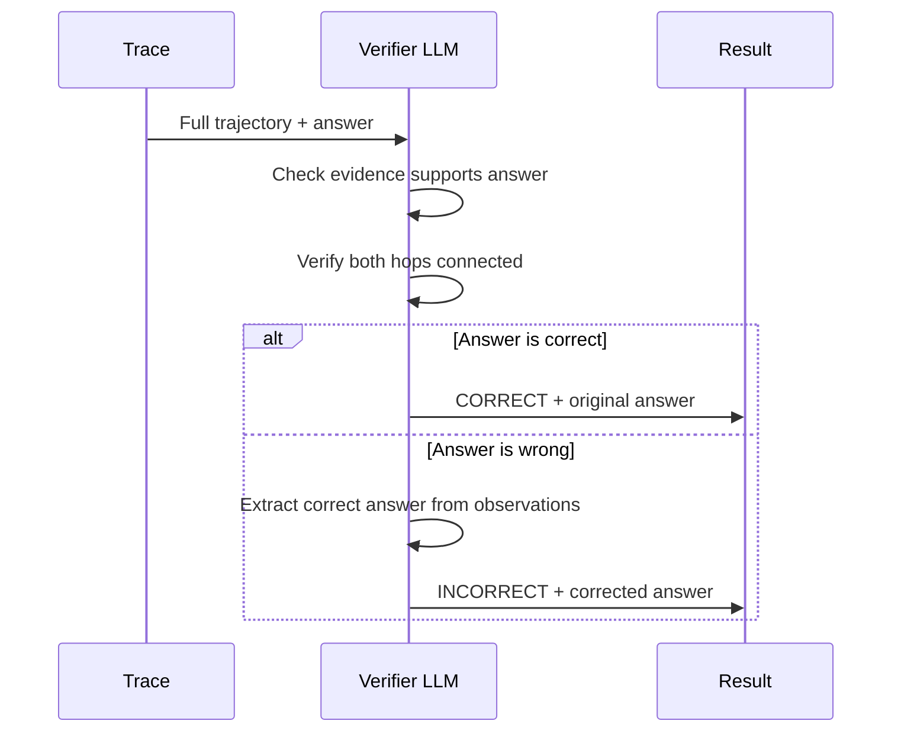

### Key Characteristics

- **Single trace + verification** - Always exactly 2 phases
- **Evidence-based correction** - Only uses info from the trace
- **Does NOT run new search** - Correction from existing evidence
- **2 LLM calls total** - Trace calls + 1 verification
- **Catches reasoning errors** - Not missing evidence errors

### Output Format

```
Verification: [CORRECT or INCORRECT]
Reasoning: [Explanation based on trace evidence]
Final Answer: [Original if correct, corrected if incorrect]
```

### Example Correction

**Question**: "Which magazine was started first, Arthur's or First for Women?"

**Trace Evidence**:
- Arthur's Magazine: 1844-1846
- First for Women: started 1989

**Agent Answer**: "First for Women" ❌

**Verification**: INCORRECT  
**Corrected Answer**: "Arthur's Magazine" ✅  
**Reasoning**: 1844 < 1989, so Arthur's was first

---

## 5. Reflexion

**File**: [`reflexion_react_agent.py`](../src/agents/hotpotqa/reflexion_react_agent.py)  
**Prompt**: [`prompts/hotpotqa_reflexion.json`](../src/agents/hotpotqa/prompts/hotpotqa_reflexion.json)

Runs a ReAct trace, verifies the answer, and if incorrect, runs a **second trace** with verification feedback as guidance to find new evidence.

### Process

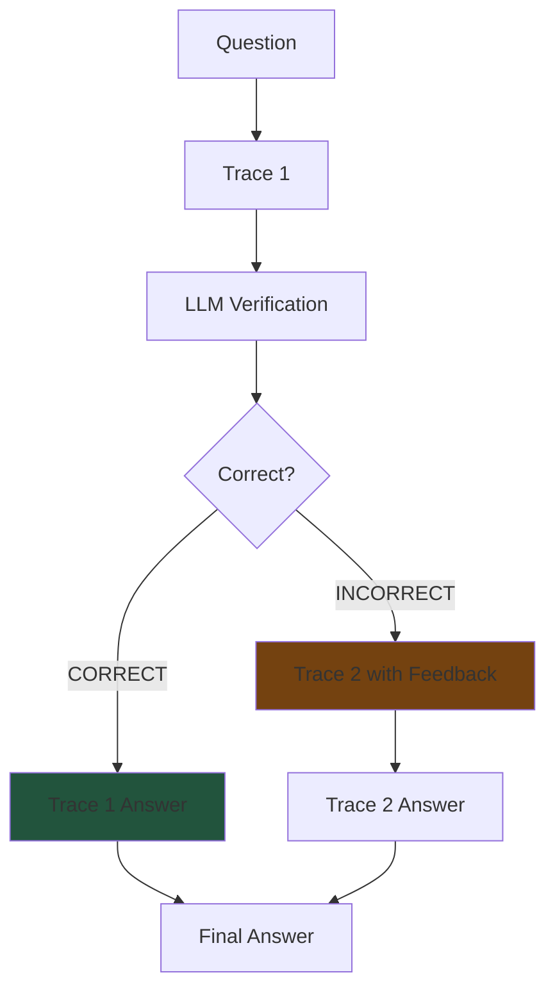

### Feedback-Guided Retry

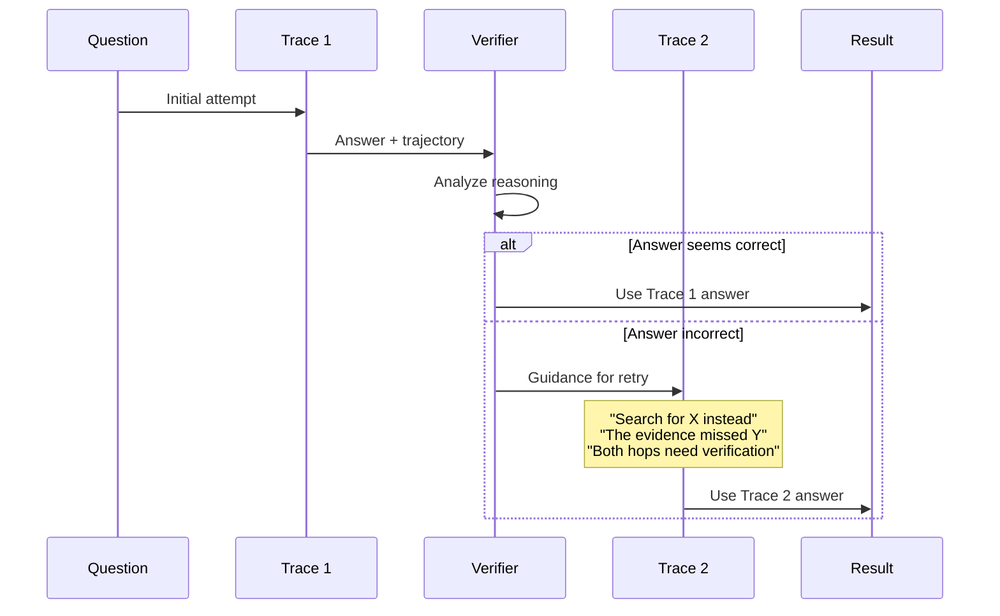

### Key Characteristics

- **1-2 traces** depending on verification result
- **Verification provides actionable guidance** - What to search next
- **Second trace can find new evidence** - Different search paths
- **2-4 LLM calls total** - 1-2 traces + 1 verification
- **Best for** - When initial search strategy missed evidence

### Verification Output Format

```
Verification: [CORRECT or INCORRECT]
Reasoning: [If INCORRECT: what went wrong, what to search, 
           how to connect both hops correctly]
```

### Feedback Context (for Trace 2)

```
Previous Attempt Feedback:
The previous attempt to answer this question was incorrect. 
Here is guidance for this attempt:
[Verification reasoning with specific search suggestions]

Use this feedback to avoid the same mistakes. Now answer the question:
```

---

## Key Differences: Self-Reflection vs Reflexion

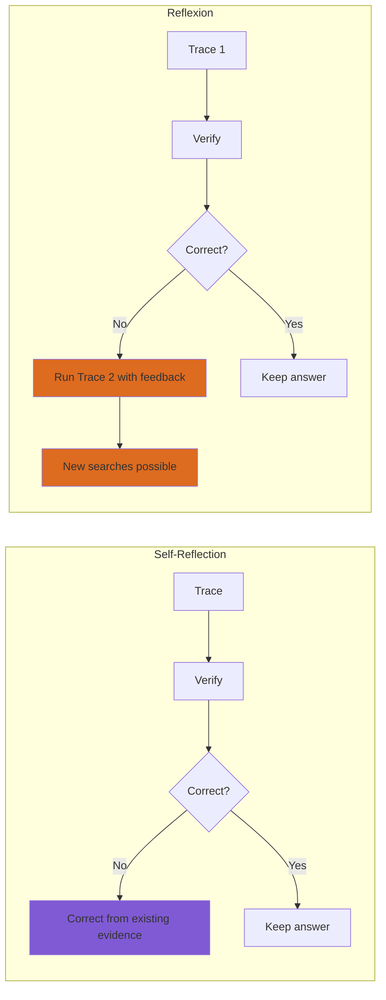

| Aspect | Self-Reflection | Reflexion |
|--------|-----------------|-----------|
| Traces executed | Always 1 | 1 or 2 |
| On incorrect answer | LLM corrects from trace | Runs new trace with guidance |
| Correction source | Same trace evidence | New search actions |
| LLM calls | Exactly 2 | 2-4 |
| Can find new evidence | ❌ No | ✅ Yes |
| Best for | Reasoning errors | Missing evidence |

### When to Use Which?

- **Self-Reflection**: When evidence is likely present but misinterpreted
- **Reflexion**: When initial search strategy may have missed relevant facts

---

## Common Utilities

All frameworks share utilities from [`hotpotqa_utils.py`](../src/agents/hotpotqa/hotpotqa_utils.py):

### Core Functions

| Function | Purpose |
|----------|---------|
| `run_single_trace()` | Execute one ReAct trace (max 7 steps) |
| `llm()` | LLM API wrapper with 3s rate limit delay |
| `step()` | Environment step execution with retry logic |
| `get_hotpotqa_env()` | Initialize WikiEnv + HotPotQAWrapper |

### Answer Processing

| Function | Purpose |
|----------|---------|
| `extract_final_answer_from_trace_string()` | Parse `Finish[answer]` from trace |
| `extract_answers_from_traces()` | Get answers from multiple traces |
| `extract_trajectories_from_traces()` | Get full trajectories for synthesis |

### Evaluation & Synthesis

| Function | Purpose |
|----------|---------|
| `synthesize_answer_with_llm()` | CoT-SC answer synthesis |
| `majority_vote_semantic()` | Semantic majority voting |
| `llm_judge_answer()` | LLM-as-judge evaluation |

---

## Environment & Actions

### HotPotQA Environment Stack

```mermaid
flowchart TB
    A[LoggingWrapper] --> B[HotPotQAWrapper]
    B --> C[WikiEnv]
    C --> D[Wikipedia API]

    style A fill:#4a5568
    style B fill:#2b6cb0
    style C fill:#2c5282
    style D fill:#2a4365
```

### Available Actions

| Action | Syntax | Description |
|--------|--------|-------------|
| Search | `Search[entity]` | Search Wikipedia, returns first paragraph |
| Lookup | `Lookup[keyword]` | Find next sentence with keyword in current page |
| Finish | `Finish[answer]` | Submit final answer |

---

## LLM Configuration

All frameworks use consistent LLM settings:

```python
{
    "model": "gemini-2.5-flash",
    "rate_limit_delay": 3.0,  # seconds between calls
    "max_output_tokens": 512,
    "default_temperature": {
        "single_trace": 0.0,   # deterministic
        "multi_trace": 0.7    # diverse
    },
    "thinking_budget": 0  # disabled for speed
}
```

---

## Running Experiments

All frameworks can be run through the unified experiment runner:

```bash
python src/agents/hotpotqa/run_hotpotqa_experiments.py \
    --num-examples 20 \
    --seed 42 \
    --frameworks react cot_sc reflexion majority_voting self_reflection
```

### Experiment Runner Features

- **Seed-based directory naming** - Easy result accumulation
- **Continuation system** - Resume from previous runs
- **Per-framework JSON results** - Individual analysis
- **Aggregate summary statistics** - Cross-framework comparison
- **Run history tracking** - Reproducibility

### Results Structure

```
results/hotpotqa/
└── seed_42/
    ├── config.json              # Experiment configuration
    ├── processed_indices.json   # Completed questions
    ├── failed_indices.json      # Failed questions
    ├── run_history.json         # All run metadata
    ├── summary.json             # Aggregate statistics
    ├── react_results.json
    ├── cot_sc_results.json
    ├── reflexion_results.json
    ├── majority_voting_results.json
    └── self_reflection_results.json
```

---

## Performance Metrics

Each framework reports:

| Metric | Description |
|--------|-------------|
| `em` | Exact Match score (0 or 1) |
| `f1` | Token-level F1 score |
| `llm_correct` | LLM-as-judge semantic evaluation |
| `n_calls` | Total LLM calls made |
| `n_badcalls` | Failed/recovery LLM calls |
| `answer` | Final predicted answer |
| `gt_answer` | Ground truth answer |
| `traj` | Full reasoning trajectory |

---

## Dataset Information

HotPotQA is a multi-hop question answering dataset requiring:

1. **Multi-hop reasoning** - Questions need information from 2+ sources
2. **Supporting facts** - Evidence must be explicitly found
3. **Bridge entities** - One entity connects to another

### Example Question

> "What government position was held by the woman who portrayed Edith Bunker?"

**Hop 1**: Edith Bunker → Jean Stapleton  
**Hop 2**: Jean Stapleton → (no government position)  
**Answer**: null (false premise question)
